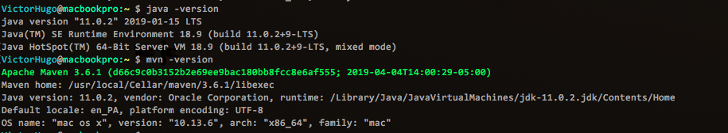
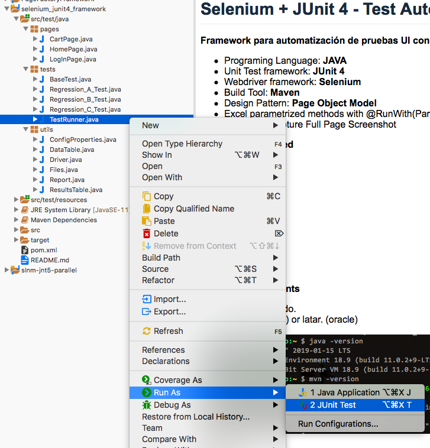
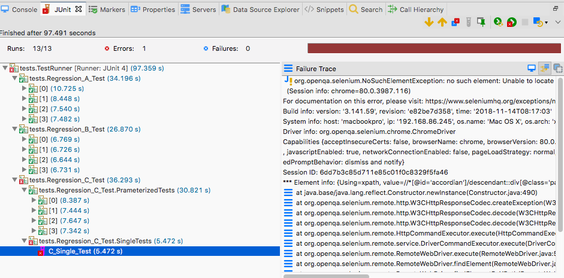
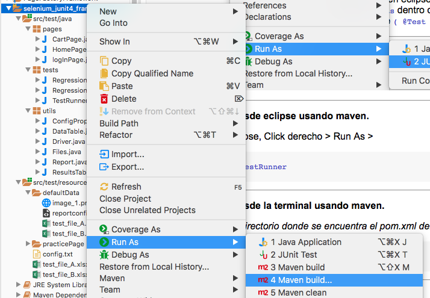
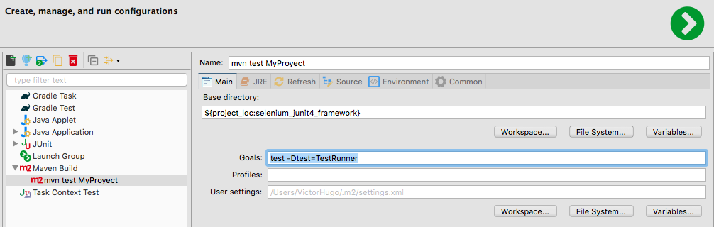
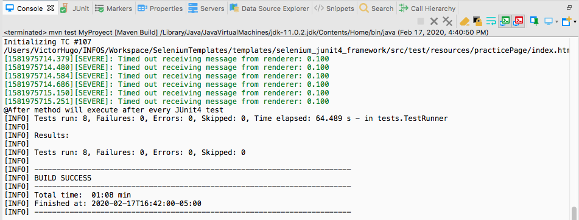
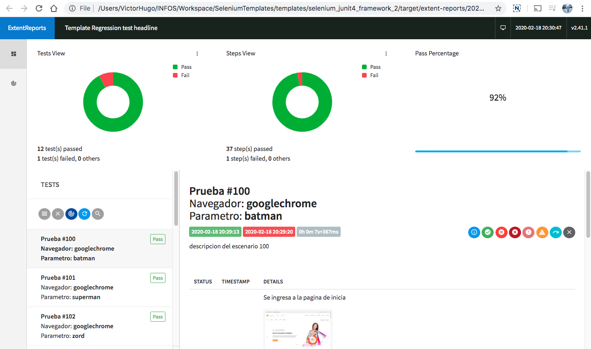

# Selenium + JUnit 4 - Test Automation Framework

**Framework para automatización de pruebas UI con Selenium y JUnit 4.**
 - Programing Language: **JAVA**
 - Unit Test framework: **JUnit 4**
 - Webdriver framework: **Selenium**
 - Build Tool: **Maven**
 - Design Pattern: **Page Object Model** 
 - Excel parametrized methods with @RunWith(Parameterized.class)
 - Ashot - To Capture Full Page Screenshot

 **Browsers Supported**
 - firefox
 - chrome
 - edge
 - others.

 **Platform Support**
 - Windows
 - Linux
 - Macintosh
 
  **System Requirements**
 - Maven + [MAVEN_HOME](https://mkyong.com/maven/how-to-install-maven-in-windows/) / [M2_HOME](https://www.tutorialspoint.com/maven/maven_environment_setup.htm)
 - [Java SE Development Kit](https://www.oracle.com/java/technologies/javase-downloads.html) ([LTS Version - oracle](https://www.oracle.com/java/technologies/javase-jdk11-downloads.html))
 - [JAVA_HOME](https://javatutorial.net/set-java-home-windows-10)
 
 
 
 **Anexos**
 
 - [Maven introduction](https://javapapers.com/jee/maven-in-10-minutes/)
 - [Maven en 10 minutes.](https://www.javiergarzas.com/2014/06/maven-en-10-min.html)
 - [¿Qué es un Java Maven Artifact ?](https://www.arquitecturajava.com/que-es-un-java-maven-artifact/)
 - [POM](http://maven.apache.org/pom.html#Properties)

---
### Inicio

Clonar el repositorio en tu maquina local en un nuevo folder *MyProject* dentro de la carpeta *INFOS*

```sh
$ cd INFOS/MyProject
$ git clone https://gitlab.com/infosgroup/rpa-team/copa-airlines/templates/selenium-junit4-framework.git
```

Una vez el repositorio este en tu carpeta de trabajo, importar a eclipse como un **proyecto maven existente**. 

Abrir el pom y editar los siguientes campos acorde al proyecto a desarrollar:
  1. groupId: com.infosgroup.client
     * ejemplo: com.infosgroup.copa
  2. artifactId: selenium_junit4_framework
     * ejemplo: WebCheckIn
  3. java.version: 1.8
     * Cambiar si tu version de java es diferente.


Click derecho al folder del proyecto, Selccionar maven -> update project

---
### Pasos para ejecutar una o varias pruebas @Tests
**Ejecutar regresión desde eclipse usando JUnit 4:**

 
 * Abrir el proyecto en eclipse.
 * Ir al paquete `tests` dentro de `src/test/java`
 * Seleccionar clase `( @Test / @RunWith(Suite.class) )` que se decea correr. Click derecho > Run As > JUnit Test
 
 (Opcional) Si se ejecuta la clase `TestRunner.java`, se puede configurar para correr varias clases editando las clases dentro de la anotacion `@Suite.SuiteClasses` .
  
 ```Java
 @Suite.SuiteClasses(
 {
        Regression_A_Test.class,  //test case 1
        Regression_B_Test.class   //test case 2
 })
```
 
 
 _ Se despliega el visualizador de JUnit _
 
 
***
**Ejecutar regresión desde eclipse usando maven.**


 _En el proyecto en eclipse, Click derecho > Run As > Maven build ..._

 
 

 _Se procede a la configuración del run:_
 * Se ingresa un nombre que identifique este run configuration.
 * Se ingresa el goal `test -Dtest=TestRunner`.
 * Se utiliza el argumento `-Dtest=TestRunner` para que maven ejecute unicamente la clase **TestRunner.java**
 
 

 _Ya se puede utilizar el nuevo run configuration para correr las pruebas usando maven_
  
  
***
**Ejecutar regresión desde la terminal usando maven.**


 _Abrir la terminal en el directorio donde se encuentra el pom.xml del projecto y ejecutar el siguiente comando._

```sh
$ mvn test -Dtest=TestRunner
```
---
### Configuración de data

* Copiar el data table .xlsx a utilizar en la carpeta `src/test/resource/dataFiles`
* Abrir el archivo `config.txt`
* Mapear el archivo .xlsx a una propiedad.
* Puedes agregar tu propia propiedad. Ejemplo: DataTableParaRegresionA = regresion_a.xlsx
* (opcional) Puedes delimitar los escenarios (cada fila (row) representa un escenario) a correr del excel con las propiedades StartRow y EndRow
  
* Asignar el data table a utilizar en cada clase:
  
 ```Java
 private static String CONFIG_DATAFILE_PROPERTY = "data_table_A";
 /*
  * Cambiar "data_table_A" por el nombre de la propiedad en el config.txt 
  * que contiene el nombre del archivo .xlsx que quieres utilizar para correr 
  * el @Test de la clase correspondiente.
  */
 ```

---
### HTML Report 

** HTML report Location: ** `./target/extent-reports/`

  

---
### JUnit .xml Report 

Se debe correr el script usando el commando de maven `mvn test -Dtest=TestRunner`  para que el archivo de 
resultados junit .xml se genere dentro del folder target.

**JUnit xml report Location: ** `./target/surefire-reports/TEST_packageName.className.xml`


---
### .gitignore

Ignora todos los reportes html generados en el folder `./target/extent-reports/`

Ignora todos los data tables utilizados en el folder `./src/test/resource/dataFiles/`

---
### Packeges

**pages**

_Este paquete contiene las clases correspondientes a cada pagina (modulo) a ser controlado por Selenium Webdriver_

* **HomePage.java**  
    * _WebElements y metodos correspondientes al index.html._
    
    
* **CartPage.java**
    * _(WebElements y metodos correspondientes al cart page.)_
    
    
* **LogInPage.java**
    * _(WebElements y metodos correspondientes al login page.)_
    
    

___
**tests**
* **BaseTest.java**

     * Clase que inicializa un unico reporte al iniciar una o varias clases de prueba @Test.
Admas contiene metodos compartidos entre los @Test


* **Regression_A_Test.java**
    * Clase que contiene **1 @Test escenario** parametrizado. (click derecho > run as > JUnit)
    
    
* **Regression_B_Test.java**
    * Clase que contiene **1 @Test escenario** parametrizado con diferente data table. (click derecho > run as > JUnit)
   
   
* **Regression_C_Test.java**
    * Clase que contiene 2 sub-clases **(2 @Test escenarios)**. Uno parametrizado con diferente data table + Otro sin parametrizar  
    * Para ejecutar click derecho > run as > JUnit > Regression_C_Test - tests.
    * En total correrían 5 escenarios (4 por el @Test parametrizado con 4 test cases en el excel + 1 escenario sin parametrizar).
    
    
* **TestRunner.java**
    * Usado para orquestar las clases que contienen JUnit tests que se quieren ejecutar.
    * Entrar a la clase y ajustar las clases que se decean correr.
    * click derecho > run as > JUnit > Regression_C_Test - tests.

___
**utils**

* **ConfigProperties.java** 
    * Clase para leer el archivo config.properties
    
    
* **DataTable.java**
    * Corresponde al formato de un data table. (Crear otra clase para usar diferentes data tables.)
    
    
* **Driver.java**
    * Clase para optener el driver a utilizar el un @Test
    
    
* **Files.java**
    * Clase para leer/escribir archivos de excel principalmente.
    
    
* **Report.java**
    * Clase que generar el reporte html.
    
    
* **ResultsTable.java**
    * Clase utilizada para crear el results table.
    
___


